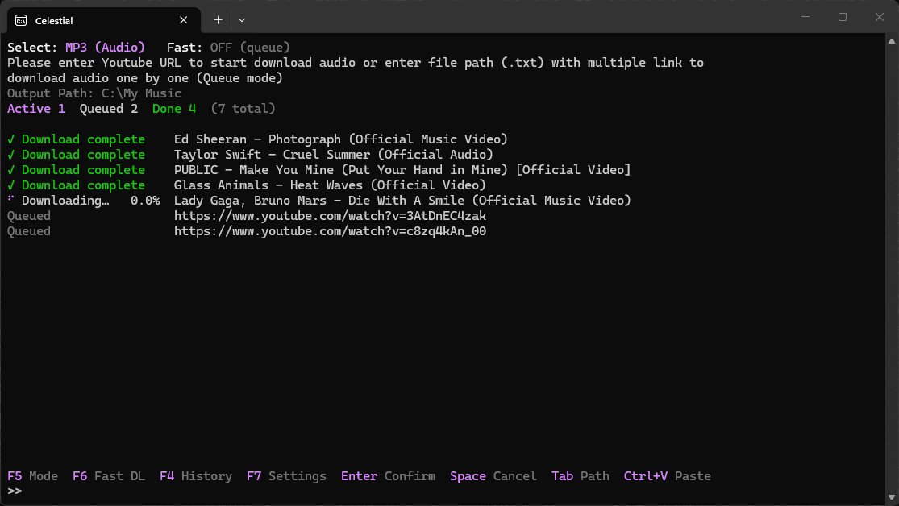

<div align="center">

# Celestial

**A fast, good-looking terminal app for downloading YouTube audio and video.** Built in Rust. Powered by `yt-dlp`. Zero setup.




[Download](https://github.com/kradengdeng/Celestial/releases/latest) | [Controls](#controls) | [Settings](#settings) | [Build from source](#build-from-source) | [Patch notes](PATCH_NOTES.md)

</div>

---

## Features

| Feature                  | Description                                                                                          |
| ------------------------ | ---------------------------------------------------------------------------------------------------- |
| **Custom TUI**           | Hand-rendered terminal interface using `crossterm` with TrueColor RGB.                               |
| **Auto-install**         | Missing `yt-dlp`, `ffmpeg` or Deno? Celestial downloads and sets them up on first run.               |
| **Audio and video**      | MP3, M4A, OPUS, FLAC or WAV audio, and MP4 video with a resolution cap.                              |
| **Playlists**            | Paste a playlist link and every video is added to the list.                                          |
| **Batch downloads**      | Enter the path of a `.txt` file with one link per line.                                              |
| **Drag & Drop**          | Drop a link or a `.txt` file onto the window to add it to the prompt.                                |
| **Queue and Fast modes** | Download one by one, or in parallel with an adjustable limit (5 to 30 at a time).                    |
| **History tab**          | Browse past downloads, download an entry again, delete one, or clear everything.                     |
| **Duplicate detection**  | Skips videos you already downloaded or that are already in the list.                                 |
| **Auto filename**        | Makes file names Windows-safe and shorter.                                                           |
| **Success sound**        | Plays a sound when a whole batch finishes.                                                           |
| **Live progress**        | Animated spinner, percentage and title for every item.                                               |
| **Clear errors**         | Failed items show the real reason, such as "Video unavailable".                                      |
| **Summary line**         | Live counts of active, queued, done, failed and cancelled items.                                     |
| **Settings menu**        | Change quality, formats, limits and the accent color inside the app. Saved automatically.            |
| **Clipboard paste**      | `Ctrl+V` pastes one link, or queues several links at once.                                           |
| **Updaters**             | Update `yt-dlp` and Celestial itself from the settings menu. Optional auto update at startup.        |
| **Folder picker**        | Press `Tab` to choose the output folder in Windows Explorer.                                         |
| **Instant cancel**       | Stop everything with `Space`.                                                                        |

---

## Requirements

- **OS:** Windows 10 or 11
- **Terminal:** [Windows Terminal](https://aka.ms/terminal) (recommended, for TrueColor and Braille spinner support)
- **Internet connection** for the first-run download of `yt-dlp`, `ffmpeg` and Deno
- **PowerShell** (built into Windows), used for the folder picker and for unpacking downloads

---

## Installation

### Option 1: Release (recommended)

1. Download `Celestial.exe` from the [latest release](https://github.com/kradengdeng/Celestial/releases/latest).
2. Put it in its own folder. It stores its helper tools, `settings.json` and `history.json` next to itself.
3. Run it. If Windows SmartScreen warns about an unsigned app, click **More info**, then **Run anyway**.

### Option 2: Build from source

Requires the [Rust toolchain](https://www.rust-lang.org/tools/install).

```
git clone https://github.com/kradengdeng/Celestial.git
cd Celestial
cargo run --release
```

The finished program is at `target/release/` after `cargo build --release`.

---

## Controls

### Main screen

| Key           | Action                                                         |
| ------------- | -------------------------------------------------------------- |
| `Enter`       | Confirm the link or file path in the prompt                    |
| `Ctrl+V`      | Paste from the clipboard (several lines add several downloads) |
| `F4`          | Open the history                                               |
| `F5`          | Switch between audio and video mode                            |
| `F6`          | Toggle Fast DL (parallel downloads)                            |
| `F7`          | Open the settings menu                                         |
| `Tab`         | Choose the output folder                                       |
| `Space`       | Cancel all active downloads (only when the prompt is empty)    |
| `Up` / `Down` | Scroll the download list                                       |
| `Esc`         | Cancel everything and quit                                     |
| `Ctrl+C`      | Cancel everything and quit                                     |

### Settings screen

| Key                           | Action                                                 |
| ----------------------------- | ------------------------------------------------------ |
| `Up` / `Down` or `W` / `S`    | Select a setting                                       |
| `Left` / `Right` or `A` / `D` | Change the selected value                              |
| `Enter`                       | Change the value, or run **Update yt-dlp / Celestial** |
| `F7` or `Esc`                 | Back to the main screen                                |

### History screen

| Key                        | Action                                       |
| -------------------------- | -------------------------------------------- |
| `Up` / `Down` or `W` / `S` | Select an entry                              |
| `F`                        | Download the selected entry again            |
| `X`                        | Delete the selected entry (asks `Y` / `N`)   |
| `C`                        | Clear all history (asks `Y` / `N`)           |
| `F4` or `Esc`              | Back to the main screen                      |

### Update prompt

| Key                                  | Action                |
| ------------------------------------ | --------------------- |
| `U`                                  | Update now            |
| `Enter`, `Esc`, `N` or `Space`       | Continue without it   |

---

## Settings

| Setting             | Options                                                    | Default      |
| ------------------- | ---------------------------------------------------------- | ------------ |
| Audio format        | MP3, M4A, OPUS, FLAC, WAV                                  | MP3          |
| Audio quality       | Best, 320K, 256K, 192K, 128K (MP3 / M4A / OPUS only)       | Best         |
| Video quality       | Best, 1080p, 720p, 480p, 360p (maximum)                    | Best         |
| Cover art & tags    | Off, On (embeds thumbnail and metadata, slower)            | Off          |
| Playlist links      | Expand all, Single video                                   | Expand all   |
| Cookies             | Off, Firefox, Chrome, Edge, Brave, cookies.txt             | Off          |
| Fast downloads      | 5, 10, 15, 20, 25, 30 at the same time                     | 5            |
| Duplicate detection | Off, On                                                    | Off          |
| Auto filename       | Off, On                                                    | Off          |
| Accent color        | Light Purple, Blue, Cyan, Green, Yellow, Orange, Pink, Red | Light Purple |
| Success sound       | Off, On                                                    | Off          |
| Auto update         | Off, On (installs new versions on startup without asking)  | Off          |
| Update yt-dlp       | Press `Enter`                                              |              |
| Update Celestial    | Press `Enter`                                              |              |

Settings, the selected mode, Fast DL state and output folder are saved to `settings.json` next to the program. Delete the file to reset everything.

---

## Usage

### Single download

Paste a YouTube link at the `>>` prompt and press `Enter`.

```
>> https://www.youtube.com/watch?v=XXXXXXXXXXX
```

### Playlist

Paste a playlist link. Every video is added as its own row. Set **Playlist links** to *Single video* to download only the video in the link. Auto-generated mixes (`list=RD...`) are always treated as a single video.

```
>> https://www.youtube.com/playlist?list=PLxxxxxxxxxxxx
```

### Batch download

Create a `.txt` file with one link per line, then enter its full path or drop the file onto the window:

```
>> C:\Users\User\Downloads\list.txt
```

### Queue vs. Fast mode

| Mode                    | Behavior                                          | Best for                 |
| ----------------------- | ------------------------------------------------- | ------------------------ |
| **Queue** (`Fast: OFF`) | One download at a time, in order                  | Stable, predictable runs |
| **Fast** (`Fast: ON`)   | Many downloads at once, up to the **Fast** limit  | Speed on large lists     |

Turning Fast on while items are waiting moves all of them into parallel mode. A download that is already running keeps going.

### Status indicators

| Status                | Meaning                               |
| --------------------- | ------------------------------------- |
| `Queued`              | Waiting for its turn                  |
| `⠋ Loading…`          | Fetching video information            |
| `⠹ Downloading…`      | In progress, with live percentage     |
| `✓ Download complete` | Finished and saved                    |
| `✗ Download failed`   | Failed, with the reason from `yt-dlp` |
| `CANCELLED`           | Stopped by the user                   |

---

## Files next to the program

| File                                            | Purpose                                                        |
| ----------------------------------------------- | -------------------------------------------------------------- |
| `settings.json`                                 | Settings, mode, Fast DL state and output folder                |
| `history.json`                                  | Download history (latest 1000 entries)                         |
| `history.json.bak`                              | Copy of a history file that could not be read                  |
| `yt-dlp.exe`, `ffmpeg.exe`, `ffprobe.exe`, `deno.exe` | Helper tools installed on first run                      |
| `cookies.txt`                                   | Your own cookie export, only if you choose the cookies.txt option |

---

## Troubleshooting

### "Sign in to confirm you're not a bot"

YouTube sometimes blocks downloads that don't look like a logged-in browser.

1. Press `F7`, select **Update yt-dlp** and press `Enter`.
2. In the same menu, set **Cookies** to the browser where you are signed in to YouTube. Firefox is the most reliable.
3. If the browser option fails (Chrome and Edge cookies can be locked or encrypted), export your cookies to a `cookies.txt` file, put it next to the program, and choose **cookies.txt**.

Keep `cookies.txt` private. It gives access to your logged-in session.

### A link is skipped as a duplicate

Duplicate detection found the video in your history or in the current list. Turn it off in the settings, or press `F` in the History tab to download an entry again.

### "Stop active downloads before updating"

Updates are blocked while something is loading or downloading. Press `Space` to cancel, then update.

---

## Updating

- **Startup notice:** after loading, Celestial checks GitHub for a newer release. If one exists, press `U` to update now, or `Enter` to continue. Updating is never forced.
- **Manual update:** open the settings (`F7`) and press `Enter` on **Update Celestial**.
- **Auto update:** turn it on in the settings to install new versions at startup without asking.

The update downloads the `.exe` attached to the latest [release](https://github.com/kradengdeng/Celestial/releases/latest), checks that it is complete and a valid Windows program, swaps it in (and rolls back if that fails), then restarts the app. Your settings and history are kept.

---

## Project structure

```
src/
  main.rs         App state, input handling, main loop
  ui.rs           Terminal rendering (main, settings, history, update screens)
  downloader.rs   Queue, parallel jobs, playlists, yt-dlp calls
  history.rs      Download history storage and duplicate lookup
  installer.rs    First-run download of yt-dlp, ffmpeg and Deno
  settings.rs     Settings model and settings.json storage
  updater.rs      Update check and self-update from GitHub releases
```

---

## Built with

- [Rust](https://www.rust-lang.org/)
- [Tokio](https://tokio.rs/): async runtime
- [Crossterm](https://github.com/crossterm-rs/crossterm): terminal control
- [Reqwest](https://github.com/seanmonstar/reqwest): downloads
- [Serde](https://serde.rs/): settings and history storage
- [arboard](https://github.com/1Password/arboard): clipboard access
- [yt-dlp](https://github.com/yt-dlp/yt-dlp), [FFmpeg](https://ffmpeg.org/) and [Deno](https://deno.com/): download, conversion and runtime

---

## Contributing

Issues and pull requests are welcome. [Open an issue](https://github.com/kradengdeng/Celestial/issues) for bugs or ideas.

---

## License

Celestial is released under the [MIT license](LICENSE).

---

## Disclaimer

This project is for **educational purposes only**. Respect YouTube's Terms of Service and the rights of content creators. Only download content you have permission to save.
