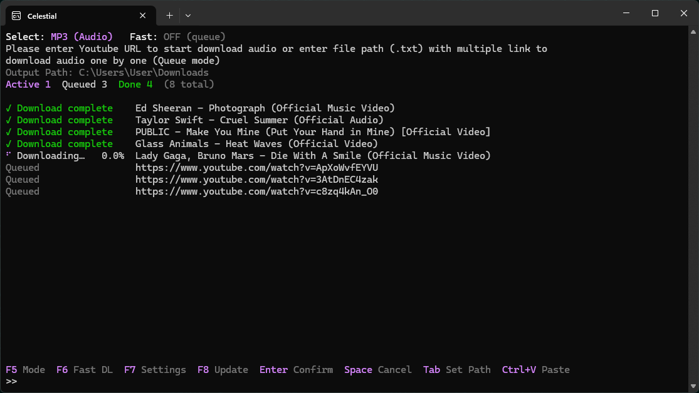

<div align="center">

# Celestial

**A fast, good-looking terminal app for downloading YouTube audio and video.**
Built in Rust. Powered by `yt-dlp`. Zero setup.


<br>

<!-- Put your screenshot at docs/screenshot.png -->


<br>

[Download](../../releases/latest) &nbsp;|&nbsp; [Controls](#controls) &nbsp;|&nbsp; [Settings](#settings) &nbsp;|&nbsp; [Build from source](#build-from-source)

</div>

---

## Features

| Feature | Description |
|---|---|
| **Custom TUI** | Hand-rendered terminal interface using `crossterm` with TrueColor RGB. |
| **Auto-install** | Missing `yt-dlp` or `ffmpeg`? Celestial downloads and sets them up on first run. |
| **Audio and video** | MP3, M4A, OPUS, FLAC or WAV audio, and MP4 video with a resolution cap. |
| **Playlists** | Paste a playlist link and every video is added to the list. |
| **Batch downloads** | Enter the path of a `.txt` file with one link per line. |
| **Queue and Fast modes** | Download one by one, or many in parallel with an adjustable limit. |
| **Live progress** | Animated spinner, percentage and title for every item. |
| **Clear errors** | Failed items show the real reason, such as "Video unavailable". |
| **Summary line** | Live counts of active, queued, done, failed and cancelled items. |
| **Settings menu** | Change quality, formats, limits and the accent color inside the app. Saved automatically. |
| **Clipboard paste** | `Ctrl+V` pastes one link, or queues several links at once. |
| **yt-dlp updater** | Press `F8` to update `yt-dlp` without leaving the app. |
| **Self-update** | Press `F9` to update Celestial from the latest GitHub release. A notice appears at startup when a new version exists, and you choose whether to update. |
| **Folder picker** | Press `Tab` to choose the output folder in Windows Explorer. |
| **Instant cancel** | Stop everything with `Space`. |

---

## Requirements

- **OS:** Windows 10 or 11
- **Terminal:** [Windows Terminal](https://aka.ms/terminal) (recommended, for TrueColor and Braille spinner support)
- **Internet connection** for the first-run download of `yt-dlp` and `ffmpeg`

---

## Installation

### Option 1: Release (recommended)

1. Download `Celestial.exe` from the [latest release](../../releases/latest).
2. Put it in its own folder (it stores `yt-dlp.exe`, `ffmpeg.exe` and `settings.json` next to itself).
3. Run it. If Windows SmartScreen warns about an unsigned app, click **More info**, then **Run anyway**.

### Option 2: One-click script

Run `install-and-run.bat`. It installs Rust if needed, builds the project, and starts it.

### Build from source

Requires the [Rust toolchain](https://www.rust-lang.org/tools/install).

```powershell
git clone https://github.com/<your-username>/<your-repo>.git
cd <your-repo>
cargo run --release
```

---

## Controls

### Main screen

| Key | Action |
|:---:|---|
| `Enter` | Confirm the link or file path in the prompt |
| `Ctrl+V` | Paste from the clipboard (several lines add several downloads) |
| `F5` | Switch between audio and video mode |
| `F6` | Toggle Fast DL (parallel downloads) |
| `F7` | Open the settings menu |
| `F8` | Update `yt-dlp` |
| `F9` | Update Celestial from GitHub |
| `Tab` | Choose the output folder |
| `Space` | Cancel all active downloads |
| `Up` / `Down` | Scroll the download list |
| `Esc` | Quit |

### Settings screen

| Key | Action |
|:---:|---|
| `Up` / `Down` or `W` / `S` | Select a setting |
| `Left` / `Right` or `A` / `D` | Change the selected value |
| `F7` or `Esc` | Back to the main screen |

---

## Settings

| Setting | Options | Default |
|---|---|---|
| Audio format | MP3, M4A, OPUS, FLAC, WAV | MP3 |
| Audio quality | Best, 320K, 256K, 192K, 128K (lossy formats only) | Best |
| Video quality | Best, 1080p, 720p, 480p, 360p (maximum) | Best |
| Cover art & tags | Off, On (embeds thumbnail and metadata) | Off |
| Playlist links | Expand all, Single video | Expand all |
| Cookies | Off, Firefox, Chrome, Edge, Brave, cookies.txt | Off |
| Parallel audio | 1, 2, 3, 5, 8, 10, 15, 20, 30 | 30 |
| Parallel video | 1, 2, 3, 5, 8, 10, 15, 20, 30 | 15 |
| Accent color | Light Purple, Blue, Cyan, Green, Yellow, Orange, Pink, Red | Light Purple |
| Auto update | Off, On (installs new versions on startup without asking) | Off |

Settings, the selected mode, Fast DL state and output folder are saved to `settings.json` next to the program. Delete the file to reset everything.

---

## Troubleshooting

### "Sign in to confirm you're not a bot"

YouTube sometimes blocks downloads that don't look like a logged-in browser.

1. Press `F8` to update `yt-dlp`.
2. Press `F7`, select **Cookies**, and choose the browser where you are signed in to YouTube. Firefox is the most reliable.
3. If the browser option fails (Chrome and Edge cookies can be locked or encrypted), export your cookies to a `cookies.txt` file, put it next to the program, and choose **cookies.txt**.

Keep `cookies.txt` private. It gives access to your logged-in session.

---

## Updating

- **Startup notice:** after loading, Celestial checks GitHub for a newer release. If one exists, you see a notice: press `U` to update now, or `Enter` to continue. Updating is never forced.
- **Manual update:** press `F9` on the main screen at any time.
- **Auto update:** turn it on in the settings to install new versions at startup without asking.

The update replaces `Celestial.exe` with the `.exe` attached to the latest [release](../../releases/latest) and restarts the app in a new window. Your `settings.json` is kept.

---

## Usage

### Single download

Paste a YouTube link at the `>>` prompt and press `Enter`.

```text
>> https://www.youtube.com/watch?v=XXXXXXXXXXX
```

### Playlist

Paste a playlist link. Every video is added as its own row.

```text
>> https://www.youtube.com/playlist?list=PLxxxxxxxxxxxx
```

Set **Playlist links** to *Single video* in the settings to download only the video in the link.

### Batch download

Create a `.txt` file with one link per line, then enter its full path:

```text
>> C:\Users\User\Downloads\list.txt
```

### Queue vs. Fast mode

| Mode | Behavior | Best for |
|---|---|---|
| **Queue** (`Fast: OFF`) | One download at a time, in order | Stable, predictable runs |
| **Fast** (`Fast: ON`) | Many downloads at once, up to the parallel limit | Speed on large lists |

### Status indicators

| Status | Meaning |
|---|---|
| `Queued` | Waiting for its turn |
| `⠋ Loading…` | Fetching video information |
| `⠹ Downloading…` | In progress, with live percentage |
| `✓ Download complete` | Finished and saved |
| `✗ Download failed` | Failed, with the reason from `yt-dlp` |
| `CANCELLED` | Stopped by the user |

---

## Project structure

```text
src/
  main.rs         App state, input handling, main loop
  ui.rs           Terminal rendering (main screen, settings, spinner)
  downloader.rs   Queue, parallel jobs, playlists, yt-dlp calls
  installer.rs    First-run download of yt-dlp and ffmpeg
  settings.rs     Settings model and settings.json storage
  updater.rs      Update check and self-update from GitHub releases
```

---

## Built with

- [Rust](https://www.rust-lang.org/)
- [Tokio](https://tokio.rs/): async runtime
- [Crossterm](https://github.com/crossterm-rs/crossterm): terminal control
- [Reqwest](https://github.com/seanmonstar/reqwest): dependency downloads
- [Serde](https://serde.rs/): settings storage
- [arboard](https://github.com/1Password/arboard): clipboard access
- [yt-dlp](https://github.com/yt-dlp/yt-dlp) and [FFmpeg](https://ffmpeg.org/): download and conversion

---

## Contributing

Issues and pull requests are welcome. [Open an issue](../../issues) for bugs or ideas.

---

## Disclaimer

This project is for **educational purposes only**. Respect YouTube's Terms of Service and the rights of content creators. Only download content you have permission to save.
